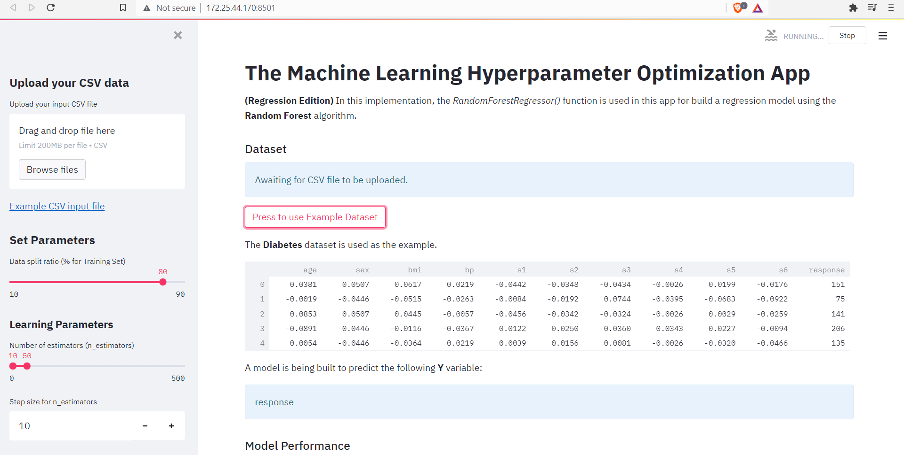
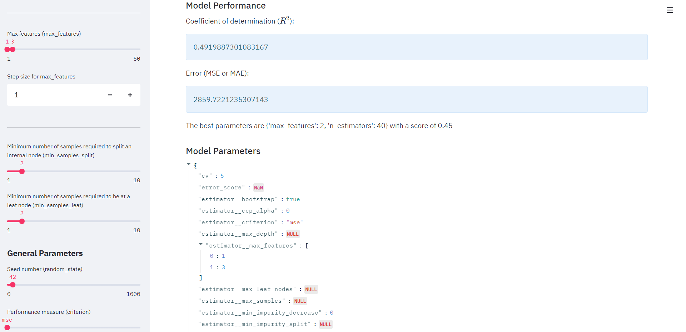
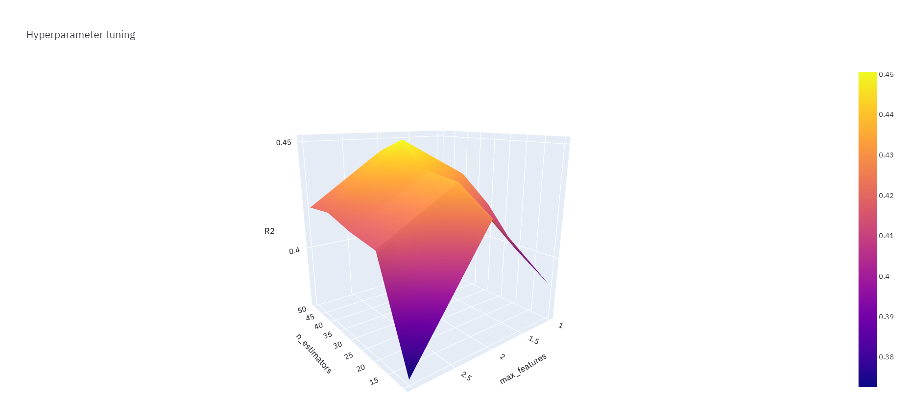

# Machine Learning Optimizer Application

Machine Learning Hyperparameter Optimizer App made with (Streamlit + Scikit-learn + Python)

# Demo

## Easy uploading datasets



## Model Parameter complete lists



## Interactive plots



Launch the web app:


# Reproducing this web app

To recreate this web app on your own computer, do the following.

### Clone the repository

```shell
https://github.com/debajyotidasgupta/ML-optimizer-app.git
```

Go to the newly created folder

```shell
cd ML-optimizer-app
```

### Create virual environment

Make sure you are using python 3.7+

Firstly install the virtualenv module running the following command

```shell
pip install virtualenv
```

Now we will be creating a virtual environment called _env_

```shell
python3 -m virualenv env
```

Activate the virtual environmen just created

```
source ./env/bin/activate
```

### Install prerequisite libraries

Download requirements.txt file

```shell
wget https://raw.githubusercontent.com/debajyotidasgupta/ML-optimizer-app/main/requirements.txt

```

Pip install libraries

```
pip install -r requirements.txt
```

### Launch the app

```python
streamlit run app.py
```
